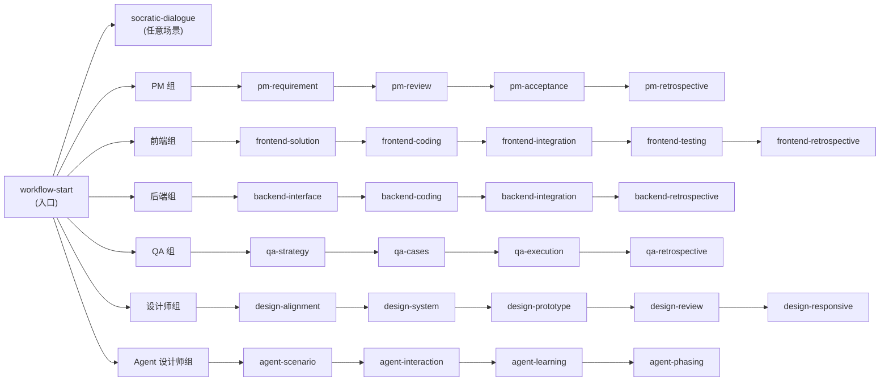

# Skill 索引地图

> 28 个 Skill 的速查表,按角色组织,每个 skill 一句话说清用途 + 触发场景 + 上下游依赖。

## 🎯 快速查找

### 我是 PM

| Skill | 一句话 | 触发场景 | 上游 | 下游 |
|---|---|---|---|---|
| [pm-requirement](skills/pm-requirement/SKILL.md) | 从命题到 PRD v1.0,含三步对话 + 4 Phase 推进 | "写 PRD"、"做需求"、"启动新项目需求" | — | pm-review |
| [pm-review](skills/pm-review/SKILL.md) | 三端并行 review,v1.0 → v3.x 终稿 | "组织 review"、"PRD 评审"、"三端对齐" | pm-requirement | pm-acceptance |
| [pm-acceptance](skills/pm-acceptance/SKILL.md) | 两场景:产品终审(coding 前)+ 功能验收(上线前) | "验收"、"终审"、"上线前检查" | pm-review | — |
| [pm-retrospective](skills/pm-retrospective/SKILL.md) | 流程 / 决策 / 协作三维复盘,沉淀 PM 视角教训 | "PM 复盘"、"项目总结"、"流程复盘" | pm-acceptance | — |

### 我是前端

| Skill | 一句话 | 触发场景 | 上游 | 下游 |
|---|---|---|---|---|
| [frontend-solution](skills/frontend-solution/SKILL.md) | 从 PRD 产出技术方案蓝图(框架 + 接口 spec + 交互图) | "写技术方案"、"前端方案设计"、"API 设计" | pm-acceptance | frontend-coding |
| [frontend-coding](skills/frontend-coding/SKILL.md) | AI Native 最佳实践写代码,含 Plan Mode + Sub-agent 策略 | "开始写代码"、"实现页面"、"AI 写前端" | frontend-solution | frontend-integration |
| [frontend-integration](skills/frontend-integration/SKILL.md) | 前后端契约对齐 + 字段映射表 + Top 5 联调教训 | "开始联调"、"接口对不上"、"字段不匹配" | frontend-coding | frontend-testing |
| [frontend-testing](skills/frontend-testing/SKILL.md) | 4 层分层测试(UI / 回归 / 数据流 / 异常边界) | "写测试"、"写 E2E"、"自动化测试" | frontend-integration | frontend-retrospective |
| [frontend-retrospective](skills/frontend-retrospective/SKILL.md) | 代码 / bug / AI 使用方式复盘,沉淀前端视角教训 | "复盘"、"项目结束了"、"写复盘文档" | frontend-testing | — |

### 我是后端

| Skill | 一句话 | 触发场景 | 上游 | 下游 |
|---|---|---|---|---|
| [backend-interface](skills/backend-interface/SKILL.md) | 产出接口契约文档(RESTful + 字段规范 + 错误码) | "设计接口"、"API spec"、"定接口字段" | pm-acceptance | backend-coding |
| [backend-coding](skills/backend-coding/SKILL.md) | 按分层架构(Controller/Service/DAO)编码,严格实现契约 | "写后端"、"实现接口"、"后端编码" | backend-interface | backend-integration |
| [backend-integration](skills/backend-integration/SKILL.md) | 配合前端联调,快速响应契约问题 | "后端联调"、"前端说字段不对"、"排查接口 bug" | backend-coding | backend-retrospective |
| [backend-retrospective](skills/backend-retrospective/SKILL.md) | 接口设计 / 数据库 / 性能复盘,沉淀后端视角教训 | "后端复盘"、"项目总结"、"服务端经验沉淀" | backend-integration | — |

### 我是 QA

| Skill | 一句话 | 触发场景 | 上游 | 下游 |
|---|---|---|---|---|
| [qa-strategy](skills/qa-strategy/SKILL.md) | 4 层分层策略设计(范围 + 工具 + 用例量预估) | "测试策略"、"测试方案设计"、"QA 计划" | pm-acceptance | qa-cases |
| [qa-cases](skills/qa-cases/SKILL.md) | 按 4 层分层产出用例,存入用例库便于回归复用 | "写测试用例"、"用例设计"、"QA 用例" | qa-strategy | qa-execution |
| [qa-execution](skills/qa-execution/SKILL.md) | 提测冒烟 + 用例执行 + bug 分级 + 回归验证 | "开始测试"、"提测了"、"跑用例"、"报 bug" | qa-cases | qa-retrospective |
| [qa-retrospective](skills/qa-retrospective/SKILL.md) | 测试策略 / 工具 / 自动化复盘,沉淀 QA 视角教训 | "QA 复盘"、"测试总结"、"测试经验沉淀" | qa-execution | — |

### 我是设计师

| Skill | 一句话 | 触发场景 | 上游 | 下游 |
|---|---|---|---|---|
| [design-alignment](skills/design-alignment/SKILL.md) | 起点对齐(Phase 0) + PRD 交叉验证(Phase 4) + 交付(Phase 6) | "开始设计"、"设计对齐"、"PRD 交叉验证" | pm-acceptance | design-system |
| [design-system](skills/design-system/SKILL.md) | Token 三层架构(Primitives→Tokens→Components)搭设计系统 | "搭设计系统"、"做 Token"、"组件库" | design-alignment | design-prototype |
| [design-prototype](skills/design-prototype/SKILL.md) | 按 10 类帧覆盖清单组装页面原型 + 产出红线 | "做原型"、"画页面"、"组装设计稿" | design-system | design-review |
| [design-review](skills/design-review/SKILL.md) | 8 项系统化审查(技术合规 5 项 + 三角审查 3 项) | "设计审查"、"深度 review"、"原型 review" | design-prototype | design-responsive |
| [design-responsive](skills/design-responsive/SKILL.md) | 按 8 条规则做多断点适配(桌面/平板/移动) | "响应式"、"断点适配"、"多屏幕支持" | design-review | design-alignment(场景 C) |

### 我是 Agent 设计师

| Skill | 一句话 | 触发场景 | 上游 | 下游 |
|---|---|---|---|---|
| [agent-scenario](skills/agent-scenario/SKILL.md) | 选定交互模型(IM机器人/内嵌后台/独立工具) + 核心场景 + 用户画像 | "设计 Agent"、"做 AI 助手"、"Copilot 设计" | — | agent-interaction |
| [agent-interaction](skills/agent-interaction/SKILL.md) | 三步确认链路设计(自然语言→填表高亮→确认提交) | "交互设计"、"Agent 流程"、"Copilot 交互" | agent-scenario | agent-learning |
| [agent-learning](skills/agent-learning/SKILL.md) | 日志→AI汇总→人工标注三层学习循环,让 Agent 越用越准 | "经验学习"、"日志设计"、"Agent 迭代机制" | agent-interaction | agent-phasing |
| [agent-phasing](skills/agent-phasing/SKILL.md) | P0-P3 分期规划(P0 能用有数据 / P1 闭环 / P2 多场景 / P3 智能化) | "Agent 规划"、"P0 P1 分期"、"Agent 路线图" | agent-scenario | — |

### 跨角色

| Skill | 一句话 | 触发场景 | 上游 | 下游 |
|---|---|---|---|---|
| [workflow-start](skills/workflow-start/SKILL.md) | 入口路由:读项目文件自动判断角色和环节,然后导航到对应 skill | "我开始工作"、"今天做什么"、"帮我定位一下" | — | 任意角色 skill |
| [socratic-dialogue](skills/socratic-dialogue/SKILL.md) | 三步对话法:苏格拉底(问真问题)→ 第一性(拆本质)→ 奥卡姆(砍最简) | "我要做 XX"、"启动新任务"、任何需要思路梳理的场合 | — | 任意产出 skill |

---

## 🔗 Skill 路由图

---

## 💡 怎么选 skill

3 种场景:

- **不知道自己是谁** → 调 `workflow-start`,系统自动读项目文件帮你判断角色和环节
- **启动任何新任务** → 调 `socratic-dialogue`,先用三步对话法把目标拆清楚,再进专属 skill
- **知道自己角色和环节** → 直接按上面的表格找到对应 skill,省去路由步骤

---

## 关于 6 个复盘 skill

当前 PM / 前端 / 后端 / QA / 设计师 / Agent 设计师各有独立复盘 skill(共 6 个)。
设计上保留独立是为了突出角色视角差异:
- PM 复盘:流程 / 决策 / 协作
- 前端复盘:代码 / bug / AI 使用方式
- 后端复盘:接口 / 数据库 / 性能
- QA 复盘:用例 / 自动化 / 协作
- 设计复盘:走 design-alignment 的场景 C
- Agent 设计复盘:暂无独立 skill,用 socratic-dialogue + 自由讨论

如果使用中发现差异不够大,后续可以考虑合并为参数化的 retrospective skill。
