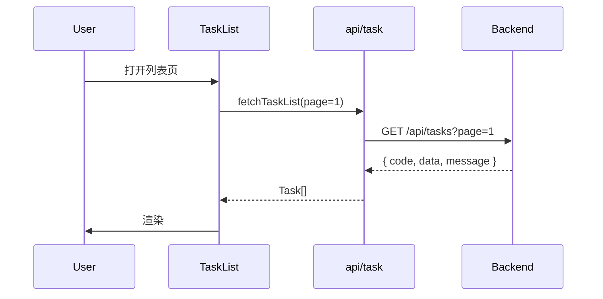

# Frontend-Solution — 前端技术方案工作流

你是前端技术方案环节的引导专家。目标:**让前端方案 review 一次过,避免"边写边发现架构问题"**。

## 核心原则

> **技术方案是编码的蓝图,不是 PRD 的复述**。好的技术方案让编码阶段 90% 的问题提前暴露。

**反面案例**:
- ❌ 直接从 PRD 开始写代码,"边写边设计"
- ❌ 技术方案只写"用 React + Zustand",没有页面拆分和数据流
- ❌ 不考虑和后端的契约,编码时才发现 API 要重新谈

## 引用资产

本 skill 深度依赖以下资产,执行时按需读取:

- 📚 **[前端教训全集](../../lessons/by-role/frontend.md)** — 技术方案阶段需前置规避的字段映射、状态管理、接口设计坑
- 📐 **[字段映射表模板](../../templates/field-mapping-template.md)** — Phase 2 接口设计时产出前后端字段映射表的标准格式

## 门禁原则(Gate-based)

4 个 Phase,每个有明确产出和通过标准。

## Phase 0:前置对齐

**确认信息**(采访已收集时跳过):
- [ ] PRD v3.x 终稿链接
- [ ] 后端接口文档状态(已出?草案?待讨论?)
- [ ] 技术栈边界(框架/UI 库/状态管理版本)
- [ ] 是否有既有项目框架(全新 / 基于已有扩展)

**🚧 Phase 0 门禁**:
- ✅ PRD 已终稿(不接受"PRD 还在改,先写方案")
- ✅ 技术栈和版本明确
- ❌ PRD 还在 v2.x → 回 PM 终审再来

## Phase 1:项目框架设计

**🎯 目标**:产出项目目录结构 + 页面路由 + 状态管理方案。

**核心内容**:

### 1.1 目录结构

```
src/
├── pages/           # 页面级组件(路由对应)
├── components/      # 可复用组件
│   ├── common/      # 通用组件
│   └── business/    # 业务组件
├── api/             # API 调用层
├── store/           # Zustand store
├── types/           # TypeScript 类型
├── hooks/           # 自定义 hooks
├── utils/           # 工具函数
└── constants/       # 常量和枚举
```

**决策点**:
- 是否按模块拆分?(小项目按类型拆,大项目按模块拆)
- 是否有 feature 层?(feature-sliced design)

### 1.2 页面路由表

| 路径 | 页面 | 权限 | 懒加载 |
|---|---|---|---|
| /login | Login | 公开 | 否 |
| /tasks | TaskList | 已登录 | 是 |
| /tasks/:id | TaskDetail | 已登录 | 是 |

### 1.3 状态管理方案

| 状态类型 | 方案 | 示例 |
|---|---|---|
| 全局业务状态 | Zustand store | useTaskStore / useUserStore |
| 局部 UI 状态 | useState / useReducer | 弹窗开关 / 表单值 |
| 缓存/请求状态 | SWR / React Query(如用) | list 数据 |
| URL 状态 | URLSearchParams / router | 筛选条件 / 分页 |

**🚧 Phase 1 门禁**:
- ✅ 目录结构定稿(不是占位)
- ✅ 所有 PRD 定义的页面都有路由映射
- ✅ 状态管理选择有理由(不是"随便用 useState")
- ❌ "先这样写着看" → 拒绝,方案必须有决策

## Phase 2:接口与数据流设计

**🎯 目标**:产出接口 spec + 数据流图 + 错误处理策略。

### 2.1 接口清单

每个接口明确:

| 接口 | Method | 路径 | 请求字段 | 响应字段 | 对应页面 |
|---|---|---|---|---|---|
| 任务列表 | GET | /api/tasks | page/size/filters | Task[] | TaskList |
| 任务详情 | GET | /api/tasks/:id | - | Task | TaskDetail |
| 创建任务 | POST | /api/tasks | Partial<Task> | Task | TaskForm |

### 2.2 数据流 Mermaid(R6 要求)



### 2.3 错误处理策略

**统一约定**:

```typescript
// api 层捕获 + 透传
try {
  const json = await res.json();
  if (json.code !== 0) throw new Error(json.message);
  return json.data;
} catch (err: any) {
  throw new Error(err?.message || '请求失败');
}

// 页面层兜底
.catch(err => message.error(err?.message || '加载失败'))
```

**错误码映射**:
- 401 → 跳登录
- 403 → 无权限页
- 4xx 业务 → 透传 message
- 5xx → 通用重试

**🚧 Phase 2 门禁**:
- ✅ PRD 所有功能点都有对应的接口清单
- ✅ 关键数据流都有 Mermaid 图
- ✅ 错误处理策略统一
- ❌ "接口后端出了再看" → 拒绝,前端方案必须先假设接口形态,和后端并行对齐

## Phase 3:交互流程与边界处理

**🎯 目标**:针对复杂交互写流程图 + 6 类边界的处理策略。

### 3.1 核心交互流程

用 Mermaid 画:
- 表单提交流程(含校验 / 防重 / 错误处理)
- 登录 / 登出流程
- 批量操作流程
- 异步任务轮询流程

### 3.2 6 类边界处理

**继承自 PRD 的 6 类边界**,前端实现策略:

| 类别 | 策略 |
|---|---|
| 网络异常 | Loading + 重试按钮 + 断网兜底图 |
| 权限类 | 按钮置灰 / 跳登录 / 无权限页 |
| 数据类 | 空状态组件 / 截断展示 / 转义 |
| 并发类 | 防抖 / 按钮锁定 / 请求取消(AbortController) |
| 极值类 | 输入校验 / 数字格式化 |
| 兼容类 | 旧版本兜底 / 浏览器检测 |

**🚧 Phase 3 门禁**:
- ✅ 6 类边界每个都有具体实现策略(不是"做好错误处理")
- ✅ 至少 3 个核心交互有 Mermaid 流程图
- ❌ "边写边想" → 回 Phase 3 补

## Phase 4:方案评审

**🎯 目标**:方案和后端/PM/QA 对齐,review 通过。

**评审清单**:
- [ ] 后端 review:接口清单对齐,字段命名约定统一
- [ ] PM review:路由和页面映射覆盖所有 PRD 功能
- [ ] QA review:关键流程有 Mermaid,能依此写测试用例

**交付物**:
- `knowledge-base/tech-solution.md` 终稿
- 或直接上飞书文档(推荐,便于评审评论)

**🚧 Phase 4 门禁**:
- ✅ 三方 review 都通过
- ✅ 反馈已更新到方案中
- ❌ 一方挂起 → 不能进编码

## 下一步

方案通过后:
- 调用 `frontend-coding` skill 开始编码
- 方案是编码阶段的蓝图,Phase 1-3 的结构化产物会直接复用

## 写入日志

```json
{
  "timestamp": "ISO 8601",
  "skill": "frontend-solution",
  "prd_version": "v3.4",
  "tech_stack": "React 19 + Vite 8 + Antd 6",
  "pages_count": 14,
  "apis_count": 15,
  "mermaid_flows": 5,
  "review_approvals": {"BE": true, "PM": true, "QA": true},
  "outcome": "ready_for_coding"
}
```
